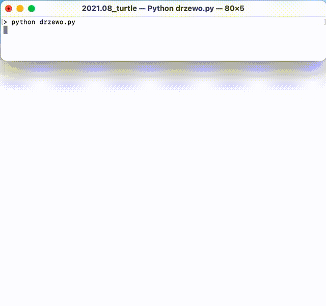

# Grafika Żółwia
Aby pomóc wyobrazić sobie działanie programu, wymyślony został żółw, który chodzi i zostawia za sobą ślad. Żółw porusza się wg instrukcji programu np. instrukcja `forward(100)` każe żółwiowi iść do przodu o 100 pikseli. Efektem tego spaceru będzie lina długości 100 pikseli, czyli ślad jaki zostawił za sobą żółw.

# Uruchomienie programu
W katalogu znajduje się kilka programów w języku programowania Python. Każdy program jest w osobnym pliku zakończonym rozszerzeniem `.py`.

Aby uruchomić któryś z programów, należy otworzyć wiersz poleceń. W zależności od systemu operacyjnego wiersz poleceń może różnie się nazywać np. *cmd*, *konsola* lub *terminal*.

Następnie w wierszu poleceń należy wpisać nazwę języka oraz nazwę pliku do wykonania:

```
> python drzewo.py
```

# Działanie programu drzewo.py
Kod źródłowy można przeczytać otwierając plik `drzewo.py`, a efekt uruchomienia programu można zaobserwować na poniższym GIFie.



# O co w tym chodzi?
Powyższe programy do rysowania geometrycznych kształtów używają **funkcji rekurencyjnej**. Podobne funkcje używane są do generowania tzw. fraktali, czyli samopodobnych wzorów. Pomyśl o liściu paproci - każda jej gałązka jest podobna do całego liścia. Podobnie jest z drzewem - każda gałąź przypomina małe drzewo.

Przykładowe filmy przedstawiające ręczne narysowane oraz komputerowo wygenerowane fraktale:

* [Rysowanie drzewa](https://www.youtube.com/watch?v=9UtdjVWSluo)
* [Generowanie 2-wymiarowego drzewa](https://www.youtube.com/watch?v=Ec8Q1q9cbbo)
* [Fraktal 3-wymiarowy](https://www.youtube.com/watch?v=zVMYaDv49jo)
